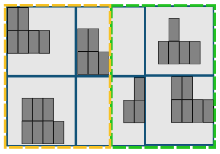

# Manitoba-vote-transposition-2018-boundaries
The results of this analsyis lead to the following story: 
<a href="https://www.cbc.ca/news/canada/manitoba/new-manitoba-election-boundaries-give-upper-hand-to-progressive-conservatives-cbc-news-analysis-finds-1.5260821">New Manitoba election boundaries give upper hand to Progressive Conservatives, CBC News analysis finds</a>

## Summary 
A year prior to the Manitoba general election held on September 10, 2019, the provincial riding boundaries were nearly all redrawn, as is required by legislation under <a href="https://web2.gov.mb.ca/laws/statutes/ccsm/e040e.php">The Electoral Divisions Act</a>. 

The Manitoba Electoral Divisions Boundaries Commission ultimately <a href="http://boundariescommission.mb.ca/2018-electoral-division-names-populations-and-deviations/?step=map-all">amended the boundaries of 56 of 57 ridings</a>. 

My goal was to determine mathematically using all available publicly-available data sources which Manitoba political party benefitted most from these changes. The results of the analysis, which transposed past election results onto the new map, showed that the Progressive Conservative Party of Manitoba stood to gain a seat. 

The riding of Fort Garry (formerly Fort Garry-Riverview) is the key riding that flips from NDP to the PCs based on the analysis:

 

## Framework of the analysis 
The analysis is essentially what is called a vote transposition, which is used by agencies, election strategists and political parties to get insight into how changes to border might affect their campaign strategy and resource allocation. 

Elections Canada is required to conduct such an analysis after each redistricting process, <a href="https://www.elections.ca/content.aspx?section=res&dir=cir/red/tran&document=index&lang=e">and did so in 2012</a>. The information is used to decide which political parties have the right to nominate election officers at the next general election, if it is held using the new boundaries. Elections Canada describes the vote tranposition used in <a href="https://www.elections.ca/res/cir/trans2013/trans2013_e.pdf">this document<a/>.
  
The exercise essentially answers the question: 
<i>If the new riding boundaries were used in a previous election, how would the outcome change?</i>

Elections results at the polling level provided by Elections Manitoba were used and then superimposed with the new riding map to determine how to distribute past results to the new ridings. 

To illustrate the process, the red boundary below represents a riding, inside of which there are six polling areas where constituents cast their votes.

 

When new boundaries are redrawn, sometimes a polling area ends up being split in half by the boundaries of the new ridings. In the case below, the two voting areas in the middle are split 50/50 and so the votes in the voting areas that were part of the original riding are now split and divvied up between the two new ridings.

 

However sometimes, part of a voting area that now falls within a new riding doesn't actually contain any voters. This could be because of commercial space, parks, agricultural land or an airport, among other things. In these cases, we don't want to include the surface area in the calculation for determining how to divide up the votes between the new ridings.

To account for this, the analysis relied on a Manitoba-wide property parcel map to eliminate all areas in the province where there is not a residential parcel. In the image below, it is clear that it wouldn't make sense to assign votes to a riding, if there are no voters that live in the area being split.

 

Unlike political parties, members of the public and media do not have access to voter lists that contain, among other things, the exact home addresses of each registered voter. With this information, an even more accurate analysis could be done. Elections Canada for example has full access to these records and so their vote tranposition is highly accurate. This diagram taken from EC's report, illustrates the point:

 

By eliminating surface area in the province without residential properties, which is the next best possible approach using public data, the accuracy of the analysis is dramatically increased compared to other vote transpositions that simply rely on surface area. 

In addition, an increasing number of Manitobans don't vote at a polling station on election day. For advance voters, write-in ballots and other non-election-night voting methods, the results were divvied up proportionally across the electoral division's populated voting areas.

## Tools used for this project

The majority of the GIS and data manipulations were done using Python's GeoPandas GIS package. GeoPandas, while very user-friendly lacks execution effeciency for certain tasks such as handling the massive amount of data contained in the property parcel data set. In order to overcome this, this data was transformed using a PostGIS-enabled Postgresql database.

Data sources are as follows:
- <a href="https://www.electionsmanitoba.ca/en/Resources/Maps">Elections Manitoba riding and polling division maps and election results</a> 
- <a href="https://data.winnipeg.ca/Assessment-Taxation-Corporate/Assessment-Parcels/d4mq-wa44">Open data assessment property parcel maps</a> 
